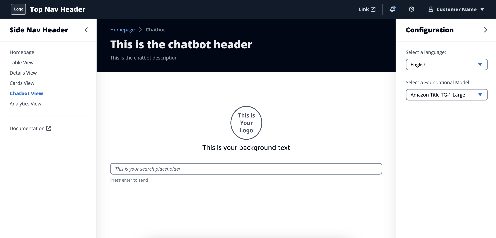
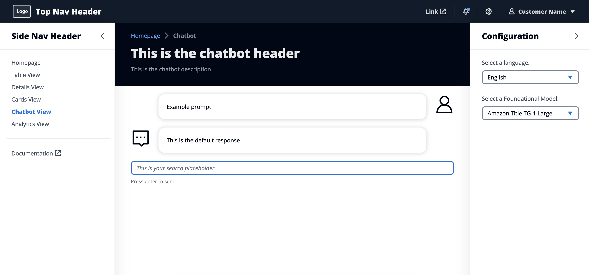
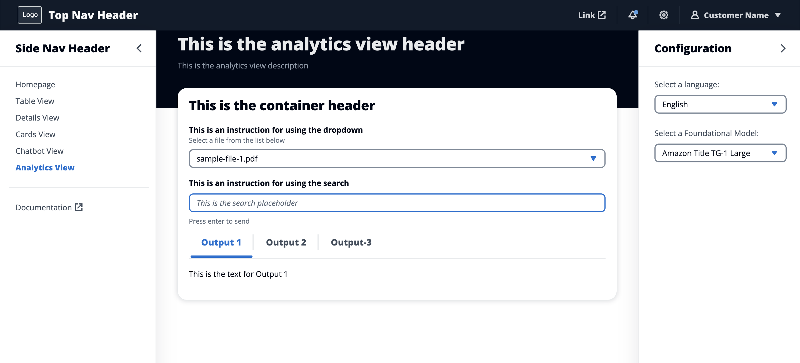

# WebUI Starter Kit

WebUI Starter Kit is a build asset for AWS Solution Building Enablement. It provides modular templates with low-code, configurable files for building web applications connected to AWS services. It is a self-service tool intended to reduce development effort for partners and accelerate completion of the Design & Build Phase of Solution Building Enablement.

## How it works

WebUI Starter Kit leverages the Cloudscape Design System to generate pre-built, configurable templates for React web applications. It includes six page types (Homepage, Table View, Details View, Cards View, Chatbot View, and Analytics View) which users can use (or remove) and then update and configure for their own use case.

For each page type, the template includes an index file and a configuration file. The configuration file enables users with limited development experience to update static data (e.g., headers) and define API calls for sending and receiving dynamic application data (e.g., database query results, AWS Lambda responses, etc.). Because the templates are modular, users can include or omit page types according to the needs of the particular application.

WebUI Starter Kit's ready-made web applications provide clean and consistent branding across SBE solutions, and give clear, prescriptive guidance on how to start developing and delivering product-centric solutions to customers. Because each configuration file defines a clear set of parameters for customization, the templates are accessible for teams with varying levels of technical depth and require minimal time for onboarding and enablement.

## User flow

**1. User clones repository and runs the application (see "Getting Started"). The running application should include the following pages:**
- Homepage
- Table View
- Details View
- Cards View
- Chatbot View
- Analytics View

**2. Template includes a folder for each page (e.g., `Homepage`), each of which contains two files:**
- `Homepage.jsx` – contains layout and components for the page
- `homepage-config.jsx` – contains customizable configuration for `Homepage.jsx`

**3. User updates `homepage-config.jsx` with:**
- Static data (labels, headers, etc.)
```
export const pageHeader = "This is the new homepage header"
```
- Props and attributes (select options, links, etc.)

```
export const PRICE_CLASS_OPTIONS = [

  { label: 'Use all locations', value: '0' },

  { label: 'Use only US, Canada, and Europe', value: '1' },

  { label: 'Use only US, Canada, Europe, and Asia', value: '2' }

];
```

**4. Dynamic data can be pulled via API using the `config.js` file**:
```
export const POST_URL='https://XXXXXXXX.execute-api.us-east-1.amazonaws.com/route'
```

**5. User implements additional customizations as needed**

## Sample pages
### Homepage


### Table View


### Details View


### Cards View


### Chatbot View




### Analytics View



## Getting started and configuration
For instructions on cloning and running the application, read `docs/getting_started.md` or click [here](https://github.com/shanjon/cloudscape-starterkit/blob/main/docs/getting_started.md).

For instructions on how to configure each page, read `docs/pages` or click [here](https://github.com/shanjon/cloudscape-starterkit/tree/main/docs/pages).