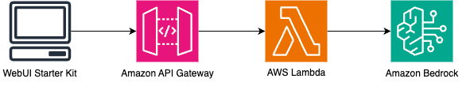

# Configuration

Configuration options for `AnalyticsView.jsx` are in multiple files. Read the section below to find the desired parameter.

## Configuration for static data
Configurable props for `CardsView.jsx` include:
- `pageHeader`
- `pageDescription`
- `alert`
- `containerHeader`
- `containerDescription`
- `placeholder`
- `sampleContentOptions`
- `dropdownInstruction`
- `searchInstruction`

These props are imported from `src/pages/AnalyticsView/analyticsview-config.md`. To modify them, open `analyticsview-config.md` and update the desired value. Default values are labeled with the name of the prop so that you can easily find the correct prop to update.

## Configuration for `tabs`
When a prompt is passed via the input component, the default response value is a hardcoded object, stored in the `tabs` prop of `Tabs` component:
```
{[
    {
    label: "Output 1",
    id: "output-1",
    content: (<>This is the text for Output 1</>)
    },
    {
    label: "Output 2",
    id: "output-2",
    content: (<>This is the text for Output 2</>)
    },
    {
    label: "Output-3",
    id: "output-3",
    content: (<>This is the text for Output 3</>)
    }
]}
```

This page is set up to allow a request to be made to API Gateway, which is then passed to a Lambda function, which can then be sent to a Large Language Model (e.g., via Amazon Bedrock, OpenAI API, etc.) and then render the response returned - for example:



The POST API request is executed via the `handleSubmit` function in `Chatbot.jsx`, which is imported from `src/services/postAPI.js`. The `postAPI.js` file imports the API Gateway URL as `POST_URL` from `src/config.js`. <br>

In order to configure the AnalyticsView for dynamic prompt responses:

1. Create a POST API in [Amazon API Gateway](https://aws.amazon.com/api-gateway/) and update the `POST_URL` in `src/config.js`.
> Note: You may want to add `config.js ` to `.gitignore` to prevent unintended access to the invoke URL.
<br>

2. Create a function in [AWS Lambda](https://aws.amazon.com/lambda/) and set the API you just created as a trigger for the function. The Lambda function should expect the following parameters:
- `inputPrompt`
- `modelName`

The response from the Lambda function should be stored as `response` in order to be passed back to `promptResponse` and rendered in the `ResponseContainer`.

`inputPrompt` is the input passed to Chatbot UI via the input text area, and `modelName` is the name of the model selected on the side panel. The response received should be stored as `repsonse`.

> Note: You will likely need to update the timeout of the Lambda function in order to allow sufficient time to call the LLM and receive a response. It will also need permission to call the model (i.e., Bedrock, SageMaker), if using an AWS service.
<br>

3. Update `tabs` in `src/pages/AnalyticsView/AnalyticsView.jsx` with the response object `{responseData}`.

If only one output is returned by the model, you can update `tabs` to only include a single output tab.